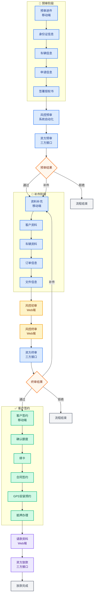
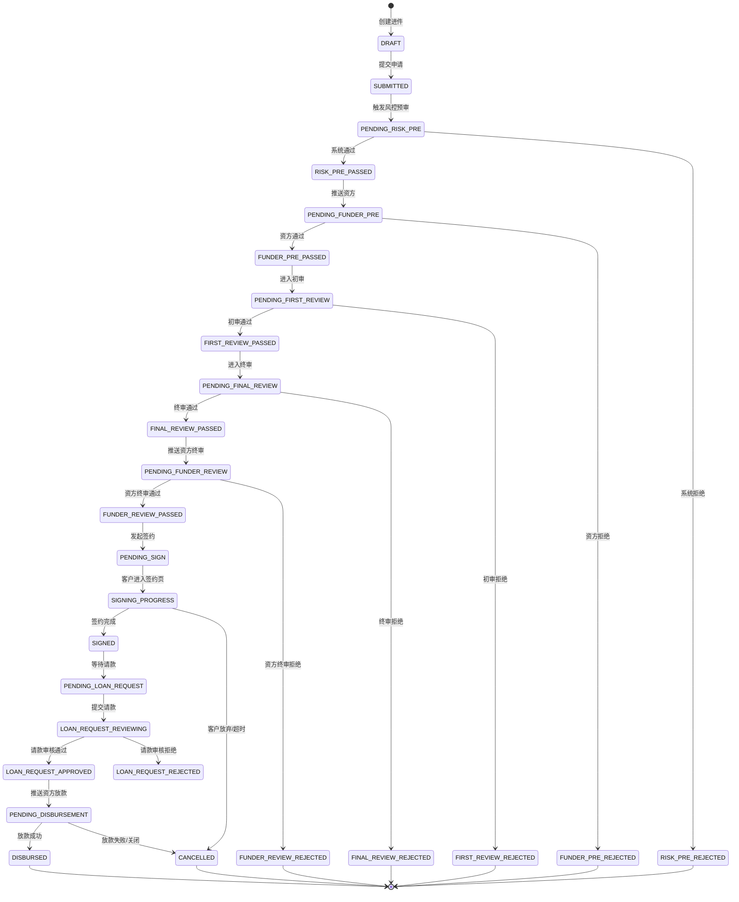

# 嗨车无忧 — 车抵贷业务流程与数据模型设计文档

> 项目：saas-project（admin-api + saas-web + saas-mobile）
> 范围：业务流程图 + 状态机 + Prisma 数据模型增量设计
> 状态：文档阶段，暂不落地开发

---

## 一、业务主流程图

> 📁 高清可打印版流程图见同目录 [`car-loan-flow-diagram.html`](./car-loan-flow-diagram.html)（可直接在浏览器打开查看/截图）。



**图例说明**

| 颜色 | 阶段 | 涉及节点 |
|------|------|----------|
| 🔵 蓝色 | 预审阶段 | 预审进件、身份证/车辆/申请信息、授权书、风控/资方预审、资料补充 |
| 🟡 橙色 | 风控审批 | 风控初审、风控终审 |
| 🟢 绿色 | 客户签约 | 确认额度、绑卡、合同签约、GPS预约、抵押办理 |
| 🟣 紫色 | 请款放款 | 请款资料、资方放款 |
| ⚪ 灰色 | 终态 | 拒绝、流程结束、放款完成 |

---

## 二、流程节点与状态机

### 2.1 节点编码（currentNode）

| 节点码 | 节点名称 | 操作端 | 执行者 |
|--------|----------|--------|--------|
| 1100 | 预审进件 | 移动端 | 客户/业务员 |
| 1200 | 风控预审 | — | 系统自动化 |
| 1300 | 资方预审 | — | 三方接口 |
| 1400 | 资料补充 | 移动端 | 客户 |
| 2100 | 风控初审 | Web | 风控专员 |
| 2200 | 风控终审 | Web | 风控主管 |
| 3100 | 资方终审 | — | 三方接口 |
| 4100 | 客户签约 | 移动端 | 客户 |
| 5100 | 请款资料 | Web | 业务专员 |
| 6100 | 资方放款 | — | 三方接口 |

### 2.2 ApplicationStatus 状态枚举（建议扩展）

```prisma
enum ApplicationStatus {
  // === 预审阶段 ===
  DRAFT                // 草稿（预审进件中）
  SUBMITTED            // 已提交（待风控预审）

  // === 自动预审 ===
  PENDING_RISK_PRE     // 风控预审中
  RISK_PRE_PASSED      // 风控预审通过
  RISK_PRE_REJECTED    // 风控预审拒绝

  // === 资方预审 ===
  PENDING_FUNDER_PRE   // 资方预审中
  FUNDER_PRE_PASSED    // 资方预审通过
  FUNDER_PRE_REJECTED  // 资方预审拒绝

  // === 补件阶段 ===
  PENDING_SUPPLEMENT   // 待补充资料

  // === 风控审批 ===
  PENDING_FIRST_REVIEW     // 风控初审中
  FIRST_REVIEW_PASSED      // 初审通过
  FIRST_REVIEW_REJECTED    // 初审拒绝
  PENDING_FINAL_REVIEW     // 风控终审中
  FINAL_REVIEW_PASSED      // 终审通过
  FINAL_REVIEW_REJECTED    // 终审拒绝

  // === 资方终审 ===
  PENDING_FUNDER_REVIEW    // 资方终审中
  FUNDER_REVIEW_PASSED     // 资方终审通过
  FUNDER_REVIEW_REJECTED   // 资方终审拒绝

  // === 签约阶段 ===
  PENDING_SIGN             // 待客户签约
  SIGNING_PROGRESS         // 签约进行中
  SIGNED                   // 签约完成

  // === 请款阶段 ===
  PENDING_LOAN_REQUEST     // 待请款
  LOAN_REQUEST_REVIEWING   // 请款审核中
  LOAN_REQUEST_APPROVED    // 请款通过
  LOAN_REQUEST_REJECTED    // 请款拒绝

  // === 放款阶段 ===
  PENDING_DISBURSEMENT     // 待放款
  DISBURSED                // 已放款

  // === 终态 ===
  CANCELLED                // 已取消/关闭
}
```

### 2.3 状态流转规则



---

## 三、多端操作矩阵

| 业务环节 | 移动端（客户） | 移动端（业务员） | Web端（风控） | Web端（业务） | 系统/三方 |
|----------|---------------|-----------------|--------------|--------------|----------|
| 预审进件 | 填资料、传证件、签授权 | 可代客录入 | — | — | — |
| 风控预审 | — | — | — | — | 系统规则引擎 |
| 资方预审 | — | — | — | — | 三方接口回调 |
| 资料补充 | 上传资料、确认信息 | 可代客补件 | — | — | — |
| 风控初审 | — | — | 审批、打回、补件 | — | — |
| 风控终审 | — | — | 审批、额度利率确认 | — | — |
| 资方终审 | — | — | — | — | 三方接口回调 |
| 客户签约 | 确认额度、绑卡、签约、GPS预约、抵押 | 可协助操作 | — | — | 电子签章接口 |
| 请款资料 | — | — | — | 整理资料、发起请款 | — |
| 资方放款 | — | — | — | — | 三方接口回调 |

---

## 四、数据模型设计（增量）

### 4.1 现有模型关系

现有 schema 已覆盖：
- `Tenant` / `Organization` / `Department` / `User` / `Role` / `Menu` / `Permission` —— 基础权限
- `Product` / `Funder` / `FlowConfig` —— 产品、资方、流程配置
- `Lead` / `LeadFollowUp` —— 线索
- `Customer` / `CustomerContact` / `Vehicle` / `BankCard` —— 客户信息
- `Application` / `ApplicationFile` —— 进件及文件
- `ApprovalRecord` —— 审批记录
- `SignRecord` —— 签约记录
- `Disbursement` —— 放款（含 GPS、抵押）
- `RepaymentPlan` / `RepaymentRecord` —— 还款计划与记录

### 4.2 SignRecord 扩展（客户签约环节）

用户明确签约包含：确认额度、绑卡、签约、GPS安装预约、抵押。现有 `SignRecord` 过于简单，建议扩展：

```prisma
model SignRecord {
  id              Int        @id @default(autoincrement())
  tenantId        Int
  applicationId   Int        @unique

  // ===== 基础签约状态 =====
  status          SignStatus @default(PENDING)
  contractUrl     String?    // 合同文件 URL
  signedAt        DateTime?  // 签约完成时间
  videoUrl        String?    // 面签视频/录屏
  expiredAt       DateTime?  // 签约过期时间
  cancelledReason String?

  // ===== 额度确认（客户对资方批复额度的确认） =====
  confirmedAmount Decimal?   @db.Decimal(15, 2) // 客户确认金额
  confirmedTerm   Int?       // 客户确认期限
  confirmedRate   Decimal?   @db.Decimal(5, 4)  // 客户确认利率
  confirmedAt     DateTime?  // 确认时间

  // ===== 绑卡 =====
  bankCardId      Int?       // 关联 BankCard.id

  // ===== GPS 安装预约（客户在签约阶段预约） =====
  gpsAppointmentAt  DateTime?  // 预约安装时间
  gpsInstallAddress String?    // 安装地址
  gpsInstallStatus  String?    @default("PENDING")
  // PENDING / APPOINTED / INSTALLED / SKIPPED
  gpsInstalledAt    DateTime?  // 实际安装完成时间
  gpsDeviceNo       String?    // GPS 设备号（安装后回填）
  gpsInstallImg     String?    // 安装照片

  // ===== 抵押办理（客户在签约阶段预约/办理） =====
  mortgageType    String?    // 抵押类型：VEHICLE_MORTGAGE / OTHER
  mortgageRegisterNo String? // 抵押登记号
  mortgageAppointmentAt DateTime? // 预约办理时间
  mortgageStatus  String?    @default("PENDING")
  // PENDING / APPOINTED / DONE / SKIPPED
  mortgageDoneAt  DateTime?  // 实际完成时间
  mortgageImg     String?    // 抵押回执/凭证

  // ===== 签约步骤追踪（用于移动端步骤条展示） =====
  currentStep     String?    @default("CONFIRM_AMOUNT")
  // CONFIRM_AMOUNT → BIND_CARD → SIGN_CONTRACT → GPS_APPOINTMENT → MORTGAGE → COMPLETE

  createdAt       DateTime   @default(now())
  updatedAt       DateTime   @updatedAt

  tenant          Tenant     @relation(fields: [tenantId], references: [id], onDelete: Cascade)
  application     Application @relation(fields: [applicationId], references: [id], onDelete: Cascade)

  @@index([tenantId])
  @@index([status])
}

enum SignStatus {
  PENDING              // 待签约
  CONFIRMING_AMOUNT    // 确认额度中
  BINDING_CARD         // 绑卡中
  SIGNING_CONTRACT     // 合同签约中
  GPS_APPOINTING       // GPS预约中
  MORTGAGING           // 抵押办理中
  SIGNED               // 签约完成
  VIDEO_INTERVIEW_DONE // 面签完成（如有视频面签）
  EXPIRED              // 签约过期
  CANCELLED            // 已取消
}
```

### 4.3 新增 LoanRequest（请款申请）

现有流程中缺少"请款资料"环节的数据承载。`Disbursement` 聚焦于放款执行，建议新增独立的请款模型：

```prisma
model LoanRequest {
  id              Int      @id @default(autoincrement())
  tenantId        Int
  orgId           Int
  applicationId   Int      @unique
  requestNo       String   @unique // 请款编号，如 LQR-20260603-001

  // 请款金额（通常等于 approvedAmount，但可能因费用调整）
  requestAmount   Decimal  @db.Decimal(15, 2)

  // 状态
  status          LoanRequestStatus @default(DRAFT)
  // DRAFT: 草稿（业务整理资料中）
  // SUBMITTED: 已提交请款
  // APPROVED: 请款审核通过
  // REJECTED: 请款审核拒绝

  requestedBy     Int      // 请款申请人（业务员/业务专员）
  requestedAt     DateTime? // 提交时间
  approvedBy      Int?     // 审批人（如有请款审批流程）
  approvedAt      DateTime? // 审批时间
  approvalOpinion String?  // 审批意见

  remark          String?
  createdAt       DateTime @default(now)
  updatedAt       DateTime @updatedAt

  tenant          Tenant   @relation(fields: [tenantId], references: [id], onDelete: Cascade)
  org             Organization @relation(fields: [orgId], references: [id], onDelete: Cascade)
  application     Application @relation(fields: [applicationId], references: [id], onDelete: Cascade)
  requester       User @relation("LoanRequestRequester", fields: [requestedBy], references: [id])
  approver        User? @relation("LoanRequestApprover", fields: [approvedBy], references: [id])

  files           LoanRequestFile[]

  @@index([tenantId])
  @@index([orgId])
  @@index([status])
  @@index([requestNo])
}

enum LoanRequestStatus {
  DRAFT
  SUBMITTED
  APPROVED
  REJECTED
}

model LoanRequestFile {
  id            Int      @id @default(autoincrement())
  loanRequestId Int
  fileType      String   // 请款资料类型
  // 如: DISBURSEMENT_APPLY_FORM, CONTRACT, ID_CARD_COPY, VEHICLE_CERT,
  //     MORTGAGE_PROOF, GPS_INSTALL_PROOF, INCOME_PROOF, BANK_CARD_COPY
  fileUrl       String
  fileName      String?
  sort          Int      @default(0)
  createdAt     DateTime @default(now)

  loanRequest   LoanRequest @relation(fields: [loanRequestId], references: [id], onDelete: Cascade)

  @@index([loanRequestId])
  @@index([fileType])
}
```

### 4.4 Application 模型关联补充

`Application` 需增加与 `LoanRequest` 的关联：

```prisma
model Application {
  // ... 现有字段保持不变 ...

  // 新增关联
  signRecord      SignRecord?
  disbursement    Disbursement?
  loanRequest     LoanRequest?      // ← 新增
  repayments      RepaymentPlan[]

  // ... 索引保持不变 ...
}
```

### 4.5 Disbursement 模型职责澄清

`Disbursement` 现有字段已覆盖 GPS 和抵押，但按新流程，GPS/抵押的**预约和办理过程**前置到签约阶段，`Disbursement` 仅保留**结果校验**和**放款执行**职责：

```prisma
model Disbursement {
  id              Int                @id @default(autoincrement())
  tenantId        Int
  applicationId   Int                @unique
  status          DisbursementStatus @default(PENDING_APPLICATION)

  // 放款金额与账户
  disburseAmount  Decimal?           @db.Decimal(15, 2)
  disburseAccount String?            // 放款账户（客户绑定的银行卡）
  disburseAt      DateTime?
  transactionNo   String?            // 资方放款流水号
  voucherUrl      String?            // 放款凭证

  // GPS / 抵押结果校验（从 SignRecord 同步，用于放款前校验）
  gpsDeviceNo     String?            // GPS 设备号
  gpsInstallImg   String?            // GPS 安装照片
  gpsInstallAt    DateTime?
  mortgageStatus  String?            // 抵押状态
  mortgageImg     String?            // 抵押回执
  mortgageAt      DateTime?

  remark          String?
  createdAt       DateTime           @default(now)
  updatedAt       DateTime           @updatedAt

  tenant          Tenant             @relation(fields: [tenantId], references: [id], onDelete: Cascade)
  application     Application        @relation(fields: [applicationId], references: [id], onDelete: Cascade)

  @@index([tenantId])
}
```

### 4.6 模型关系总览（增量后）

```
Tenant ── Organization ── Department ── User
  │
  ├── Product ─────┐
  ├── Funder ──────┼──→ Application ── ApplicationFile
  ├── FlowConfig   │        │
  ├── Lead ────────┘        ├─→ Customer ── Vehicle
  │                         │     └─ BankCard
  │                         ├─→ ApprovalRecord
  │                         ├─→ SignRecord（扩展：额度/绑卡/GPS/抵押）
  │                         ├─→ LoanRequest ── LoanRequestFile（新增）
  │                         ├─→ Disbursement
  │                         └─→ RepaymentPlan ── RepaymentRecord
  │
  └── OperationLog
```

---

## 五、菜单权限建议

### 5.1 Web 端（saas-web）菜单

```
业务管理
├── 线索管理          permission: lead:list
├── 客户管理          permission: customer:list
├── 进件管理          permission: application:list
│   ├── 全部进件
│   ├── 待我初审       permission: application:first-review
│   ├── 待我终审       permission: application:final-review
│   ├── 待签约         permission: application:pending-sign
│   └── 请款管理       permission: loan-request:list
├── 签约管理          permission: sign-record:list
├── 放款管理          permission: disbursement:list
└── 还款计划          permission: repayment:list

风控管理
├── 风控初审          permission: risk:first-review
├── 风控终审          permission: risk:final-review
└── 审批记录          permission: approval-record:list

产品配置
├── 产品管理          permission: product:list
├── 资方管理          permission: funder:list
└── 流程配置          permission: flow-config:list
```

### 5.2 移动端（saas-mobile）页面/权限

移动端以客户自主操作为主，无需复杂菜单权限，按角色区分可见入口：

| 角色 | 可见入口 |
|------|----------|
| 客户（借款人） | 我的申请、资料补充、签约中心、还款计划 |
| 业务员 | 客户录入、代客进件、代客补件、代客签约、我的客户 |

移动端接口权限通过 `X-Tenant-ID` + `X-Org-Id` + `Authorization` 头控制，配合 `sessionStore.transferToken` 做客户token传递。

---

## 六、关键接口场景（供后续开发参考）

### 6.1 风控预审（系统自动化）

```
触发条件：Application.status = SUBMITTED
执行：调用风控规则引擎 / 内部评分模型
结果：
  - 通过 → status = RISK_PRE_PASSED, currentNode = 1300
  - 拒绝 → status = RISK_PRE_REJECTED, 记录拒绝原因
```

### 6.2 资方预审（三方回调）

```
推送：Application 数据 + Customer + Vehicle 推送资方
回调：资方返回预审结果
  - 通过 → status = FUNDER_PRE_PASSED, currentNode = 2100
  - 拒绝 → status = FUNDER_PRE_REJECTED
  - 补件 → status = PENDING_SUPPLEMENT, currentNode = 1400
```

### 6.3 客户签约（移动端分步提交）

```
Step 1: POST /sign/confirm-amount
  body: { confirmedAmount, confirmedTerm, confirmedRate }
  → SignRecord.currentStep = BIND_CARD

Step 2: POST /sign/bind-card
  body: { bankCardId } 或 新增绑卡
  → SignRecord.currentStep = SIGN_CONTRACT

Step 3: POST /sign/sign-contract
  body: { contractAgreement: true }
  → 生成合同、调电子签章接口
  → SignRecord.currentStep = GPS_APPOINTMENT

Step 4: POST /sign/gps-appointment
  body: { gpsAppointmentAt, gpsInstallAddress }
  → SignRecord.currentStep = MORTGAGE

Step 5: POST /sign/mortgage
  body: { mortgageType, mortgageAppointmentAt }
  → SignRecord.currentStep = COMPLETE
  → SignRecord.status = SIGNED
  → Application.status = SIGNED, currentNode = 5100
```

### 6.4 请款资料（Web端）

```
1. 业务员在 Web 端整理请款资料
   POST /loan-requests/{id}/files

2. 提交请款申请
   POST /loan-requests/{id}/submit
   → LoanRequest.status = SUBMITTED
   → Application.status = LOAN_REQUEST_REVIEWING

3. 审批人审核（如有）
   POST /loan-requests/{id}/approve 或 /reject
   → 通过: status = LOAN_REQUEST_APPROVED, Application.status = PENDING_DISBURSEMENT
   → 拒绝: status = LOAN_REQUEST_REJECTED, 退回补充
```

---

## 七、待决策事项

1. **风控预审规则**：是否接入外部征信/大数据风控，还是纯内部规则？
2. **资方预审与终审**：资方接口是异步回调还是同步返回？是否需要轮询机制？
3. **GPS / 抵押实际执行**：客户在移动端"预约"后，实际安装/抵押是由第三方上门还是客户自行前往？完成状态由谁确认？
4. **请款审批**：请款是否需要二级审批，还是业务员提交后直接推送资方？
5. **电子签章**：合同签约使用哪家电子签章服务商（e签宝、法大大、契约锁）？
6. **额度确认**：客户确认的额度是否允许低于资方批复额度？是否需要重新触发资方终审？

---

## 八、后续开发顺序建议

1. **第一阶段**：补充 ApplicationStatus 枚举、扩展 SignRecord、新增 LoanRequest 模型，生成 Prisma Migration
2. **第二阶段**：实现风控预审/资方预审的状态流转（系统自动化 + 三方回调）
3. **第三阶段**：实现移动端签约流程（分步提交、步骤追踪）
4. **第四阶段**：实现 Web 端请款资料管理与提交
5. **第五阶段**：放款回调与还款计划生成
6. **第六阶段**：菜单权限配置、角色种子数据补充

---

*文档版本：v1.0*
*编写日期：2026-06-03*
