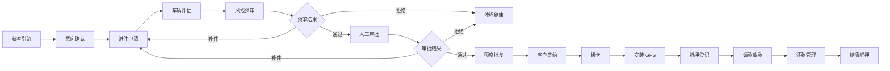

# 市场主流车抵贷业务流程文档

> 适用范围：车抵贷（车辆抵押贷款）业务的产品、风控、运营、技术团队
> 文档定位：梳理当前国内市场主流车抵贷业务的全流程，作为予艺助手 SaaS 系统车抵贷模块的业务参考与流程对齐依据
> 版本：v1.0
> 编写日期：2026-07-23

---

## 一、车抵贷业务概述

### 1.1 业务定义

车抵贷（车辆抵押贷款）是指借款人以本人或第三人名下的机动车辆作为抵押物，向金融机构或类金融机构申请资金的融资方式。

核心特点：

- **额度较高**：通常为车辆评估价的 50%–120%（视产品模式与风控策略而定）
- **放款较快**：资料齐全情况下，可实现 T+0 或 T+1 放款
- **客群广泛**：覆盖征信良好但短期资金周转需求的个人车主
- **风险可控**：车辆作为抵押物，具备实物资产兜底

### 1.2 主流产品模式

| 模式 | 是否押车 | 是否装 GPS | 是否办理抵押登记 | 适用场景 |
|------|---------|-----------|----------------|---------|
| **押车模式（车库模式）** | 是 | 否 | 是/否 | 二手车、高额度、高风险客户 |
| **不押车 + GPS 模式** | 否 | 是 | 是 | 主流模式，客户用车不受影响 |
| **不押车 + 只押证模式** | 否 | 否 | 是 | 低风险客户、额度偏低 |
| **背户车 / 网约车模式** | 否 | 是 | 是 | 营运车辆、以租代购车辆 |

目前国内市场**以「不押车 + GPS + 抵押登记」为主流**，用户体验与风控能力兼顾。

---

## 二、主流车抵贷全流程

```
获客引流 → 意向确认 → 进件申请 → 车辆评估 → 风控审批 → 额度批复 → 签约绑卡 → 抵押/GPS → 请款放款 → 还款管理 → 结清解押
```

### 2.1 流程总览图



---

## 三、各阶段详细说明

### 3.1 获客引流

| 项目 | 说明 |
|------|------|
| 主要渠道 | 4S 店、二手车商、SP（汽车金融渠道商）、电销、网销、短视频投放、老客户转介绍 |
| 获客方式 | 线上 H5/小程序留资、线下渠道驻点、电销触达 |
| 关键指标 | CAC（获客成本）、线索转化率、渠道 ROI |
| 合规要求 | 禁止虚假宣传利率、禁止诱导借贷、明确披露综合资金成本 |

### 3.2 意向确认

| 项目 | 说明 |
|------|------|
| 执行角色 | 业务员 / 渠道专员 |
| 核心动作 | 了解客户资金需求、车辆情况、征信大致情况、还款能力 |
| 输出结果 | 判断客户是否符合基本准入，生成线索或直接转为客户 |
| 常见准入条件 | 车辆登记在客户本人名下、车龄 ≤ 10 年、行驶里程 ≤ 15 万公里、无重大事故 |

### 3.3 进件申请

| 项目 | 说明 |
|------|------|
| 执行角色 | 客户 / 业务员代客录入 |
| 操作端 | 移动端 APP / 小程序 / H5 |
| 采集信息 | 身份证信息、车辆信息（行驶证、登记证、车辆照片）、银行卡信息、联系人信息 |
| 授权文件 | 征信查询授权书、个人信息使用授权书、车辆评估授权书 |
| 关键动作 | OCR 识别证件、人脸识别、活体检测、四要素鉴权 |

**常见采集资料清单**：

- 身份证正反面
- 机动车登记证书（绿本）
- 机动车行驶证
- 车辆交强险/商业险保单
- 车辆实拍照片（车头、车尾、车架号、仪表盘里程）
- 客户手持身份证照片
- 银行卡

### 3.4 车辆评估

| 项目 | 说明 |
|------|------|
| 执行角色 | 评估师 / 第三方评估平台 |
| 评估方式 | 线上评估（输入车型、上牌时间、里程）+ 线下验车 |
| 评估结果 | 车辆评估价、建议授信成数 |
| 影响因素 | 品牌、车龄、里程、车况、事故记录、市场流通性 |

常见授信规则：

- 普通燃油车：评估价的 70%–100%
- 新能源车：评估价的 50%–80%
- 豪华车/保值车型：可适当提高成数

### 3.5 风控审批

#### 3.5.1 系统自动化风控（预审）

| 项目 | 说明 |
|------|------|
| 执行角色 | 风控规则引擎 / 大数据模型 |
| 数据来源 | 人行征信、百行征信、同盾、百融、法海、车辆大数据、司法涉诉 |
| 主要规则 | 反欺诈规则、信用评分、多头借贷、黑名单、异常行为识别 |
| 输出结果 | 通过 / 拒绝 / 人工复核 / 补件 |

#### 3.5.2 人工审批

| 项目 | 说明 |
|------|------|
| 执行角色 | 风控专员 / 风控主管 |
| 审批内容 | 资料真实性核验、还款能力评估、车辆价值复核、电核 |
| 电核对象 | 客户本人、紧急联系人、单位 / 配偶（视产品要求） |
| 输出结果 | 通过（确认额度、利率、期限）/ 拒绝 / 补件 |

### 3.6 额度批复

| 项目 | 说明 |
|------|------|
| 输出内容 | 批复额度、批复利率、批复期限、还款方式 |
| 利率区间 | 月息约 0.6%–1.5%（年化约 7.2%–18%，视资方与客户资质） |
| 期限 | 3–36 期为主流 |
| 还款方式 | 等额本息、先息后本、等本等息 |

### 3.7 客户签约

| 项目 | 说明 |
|------|------|
| 执行角色 | 客户 |
| 操作端 | 移动端 |
| 签约内容 | 借款合同、抵押合同、担保合同、征信授权、还款代扣授权 |
| 技术手段 | 电子签章（e 签宝 / 法大大 / 契约锁）、人脸识别、短信验证码 |
| 关键动作 | 客户确认额度、确认合同条款、完成电子签名 |

### 3.8 绑卡

| 项目 | 说明 |
|------|------|
| 目的 | 绑定放款卡与还款卡 |
| 验证方式 | 银行卡四要素验证、小额鉴权 |
| 注意事项 | 优先使用客户本人名下的一类储蓄卡 |

### 3.9 GPS 安装

| 项目 | 说明 |
|------|------|
| 适用模式 | 不押车模式 |
| 执行方式 | 客户到指定门店安装 / 第三方上门安装 |
| 设备数量 | 通常 1–2 个（有线 + 无线） |
| 关键动作 | 安装完成拍照上传、设备激活、平台绑定 |
| 费用处理 | 部分产品收取 GPS 设备费 / 流量费 / 安装费 |

### 3.10 抵押登记

| 项目 | 说明 |
|------|------|
| 办理机构 | 车管所 |
| 办理方式 | 客户自行办理 / 业务员陪同 / 第三方代办 |
| 所需材料 | 机动车登记证书、身份证、抵押合同、营业执照复印件（资方提供） |
| 登记结果 | 车管所出具抵押登记页，登记证书标注抵押权人 |
| 合规要求 | 抵押登记为车抵贷核心风控动作，必须真实办理 |

### 3.11 请款放款

| 项目 | 说明 |
|------|------|
| 执行角色 | 业务专员 / 财务 |
| 操作端 | Web 管理后台 |
| 请款资料 | 合同、身份证、车辆证件、抵押证明、GPS 安装证明、放款卡信息 |
| 放款方式 | 资方对公或对私转账至客户绑定银行卡 |
| 放款时效 | 资料齐全后 T+0 或 T+1 |
| 费用扣除 | 部分产品在放款时一次性扣除服务费、GPS 费、保险费等 |

### 3.12 还款管理

| 项目 | 说明 |
|------|------|
| 还款方式 | 银行代扣、主动还款、线下转账 |
| 还款提醒 | 短信 / APP 推送 / 人工电催 |
| 逾期处理 | 逾期罚息、电催、上门催收、拖车、诉讼 |
| 提前还款 | 通常需支付剩余本金 + 当期利息 + 提前还款违约金（部分产品无违约金） |

### 3.13 结清解押

| 项目 | 说明 |
|------|------|
| 触发条件 | 客户还清全部本金、利息、费用 |
| 结清证明 | 资方出具贷款结清证明 |
| 解押流程 | 客户持结清证明到车管所办理解除抵押登记 |
| GPS 处理 | 结清后通知客户拆除 GPS（部分产品由客户自行处理） |

---

## 四、主流资方与产品要素

### 4.1 常见资方类型

| 资方类型 | 代表机构 | 特点 |
|---------|---------|------|
| 银行系 | 平安银行、新网银行、微众银行 | 利率低、风控严、额度高 |
| 持牌消费金融 | 招联、马上、兴业消费金融 | 审批快、线上化程度高 |
| 汽车金融公司 | 上汽通用金融、丰田金融 | 绑定品牌车源、流程成熟 |
| 融资租赁公司 | 平安租赁、易鑫集团 | 可做背户车、营运车，模式灵活 |
| 小贷 / 典当 | 各地小贷公司、典当行 | 门槛较低、利率较高、额度灵活 |

### 4.2 主流产品要素对比

| 要素 | 银行系 | 消金系 | 融资租赁 |
|------|--------|--------|---------|
| 额度 | 5–100 万 | 3–50 万 | 3–80 万 |
| 年化利率 | 6%–12% | 10%–18% | 12%–24% |
| 期限 | 12–60 期 | 12–36 期 | 12–36 期 |
| 是否押车 | 一般不押 | 一般不押 | 可选 |
| GPS | 通常需要 | 通常需要 | 通常需要 |
| 抵押登记 | 必须 | 必须 | 必须 |
| 审批时效 | 1–3 天 | 1–2 天 | 当天–2 天 |

---

## 五、风控要点

### 5.1 贷前风控

- 身份真实性核验（实名认证、活体检测、OCR）
- 车辆真实性核验（VIN 码、行驶证、登记证真伪）
- 车辆状态核验（查封、抵押、盗抢、事故、水泡、火烧）
- 征信评估（逾期记录、负债率、查询次数）
- 反欺诈识别（多头借贷、黑名单、团伙欺诈）
- 还款能力评估（收入、职业、联系人交叉验证）

### 5.2 贷中风控

- 合同合规性审查
- 抵押登记真实性核验
- GPS 安装与激活核验
- 放款前复核（额度、利率、账户一致性）

### 5.3 贷后风控

- 还款计划跟踪与提醒
- GPS 轨迹监控（异常停留、出省、失联）
- 逾期催收分级（M1–M3+）
- 资产处置（拖车、拍卖、诉讼）
- 结清解押闭环管理

---

## 六、与予艺助手系统流程的映射

| 市场主流阶段 | 予艺助手系统节点 | 系统模块 |
|-------------|-----------------|---------|
| 获客引流 / 意向确认 | 线索管理（Lead） | lead |
| 客户信息录入 | 客户管理（Customer） | customer |
| 车辆信息录入 | 车辆管理（Vehicle） | vehicle |
| 进件申请 | 预审进件（Application） | application |
| 风控预审 | 风控预审 | mobile-business / application |
| 资方预审/终审 | 资方预审 / 资方终审 | mobile-business |
| 人工审批 | 风控初审 / 风控终审 | approval |
| 客户签约 | 客户签约 | signing |
| 绑卡 | 绑卡 | mobile-business |
| GPS 安装 / 抵押办理 | GPS 预约 / 抵押办理 | mobile-signing / disbursement |
| 请款放款 | 请款资料 / 资方放款 | loan-request / disbursement |
| 还款管理 | 还款计划 / 还款记录 | repayment |
| 结清解押 | 结清解押 | repayment / disbursement |

---

## 七、关键业务规则建议

1. **抵押登记必须真实办理**：车抵贷区别于信用贷的核心风控动作，未办理抵押登记的业务不应放款。
2. **GPS 激活后方可放款**：不押车模式下，GPS 安装与平台激活应作为放款前置条件。
3. **额度与车辆评估价挂钩**：建议设置最高授信成数，并根据车型、车龄、车况动态调整。
4. **费率透明合规**：所有利息、服务费、GPS 费、保险费应在签约前明确披露，避免合规风险。
5. **结清后及时解押**：建立结清 → 出具证明 → 解押 → 拆除 GPS 的闭环流程，提升客户体验。

---

## 八、相关文档

- [`car-loan-flow-design.md`](./car-loan-flow-design.md) — 予艺助手车抵贷内部流程与数据模型设计
- [`car-loan-flow-diagram.html`](./car-loan-flow-diagram.html) — 车抵贷业务流程可视化图
- [`BUSINESS_PROCESS.md`](./BUSINESS_PROCESS.md) — 项目整体业务流程接口文档

---

*文档版本：v1.0*
*编写日期：2026-07-23*
